  

  

  
  
  

  
  
  
  

 

<h3 align="center">I build where AI, software, and machines meet. Then I ship it.</h3>

 

## Signal

Numbers, not adjectives.

  

  

  

## Focus

Three disciplines. One builder.

<table>
  <tr>
    <td width="33%" valign="top">
      <h4>AI Systems</h4>
      RAG pipelines, LLM apps, computer vision. 
      From notebook to production.
        
      
    </td>
    <td width="33%" valign="top">
      <h4>Full-Stack</h4>
      Interfaces, APIs, and tools. 
      Designed and shipped end to end.
        
      
    </td>
    <td width="33%" valign="top">
      <h4>Robotics</h4>
      PLC, ABB, vision in the loop. 
      Code that moves metal.
        
      
    </td>
  </tr>
</table>

## Work

A few things worth showing.

<table>
  <tr>
    <td width="50%" valign="top">
      <h4>Super AI Engineer SS5</h4>
      An enterprise RAG chatbot, built and shipped. 
      Outstanding Innovation Award. Later CAIO for chatbot solutions.
        
      <a href="https://github.com/NineNatthanarong/NRAG">Repository →</a>
    </td>
    <td width="50%" valign="top">
      <h4>AI Smart Parking</h4>
      Vision and control, working together. 
      Finalist, PLC Competition Thailand.
    </td>
  </tr>
  <tr>
    <td width="50%" valign="top">
      <h4>HyperGas AI</h4>
      Safety training for gas stations. 
      Fewer errors. Better readiness.
    </td>
    <td width="50%" valign="top">
      <h4>functions.codes</h4>
      Free tools, no ads. 
      Just the thing you came for.
        
      <a href="https://github.com/NineNatthanarong/functions-codes">Repository →</a>
    </td>
  </tr>
</table>

## Proof

| | |
| :-- | :-- |
| **Award** | Outstanding Innovation Award — Super AI Engineer Season 5 |
| **Leadership** | Head of Operations, BU ROBOTSTUDIO — 50+ members |
| **Finals** | PLC Thailand · LearnLab · PTT Gaskathon · Mitsubishi PLC 2026 · ABB Top 8 |
| **Study** | B.Eng in AI Engineering, Bangkok University — full scholarship |

## Toolkit

**Intelligence** — `Python` `LLM` `RAG` `NLP` `Computer Vision` `Model Deployment`

**Product** — `TypeScript` `React` `Next.js` `Node.js` `Django` `Docker` `CI/CD`

**Machines** — `PLC` `Ladder Logic` `ABB Robotics` `Point Cloud` `Serial Comms`

## Say hello

Good projects start with a simple message.

  
  
  

