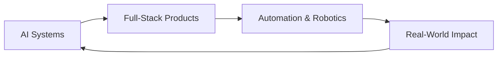

<p align="center">
  
</p>

<p align="center">
  
</p>

<p align="center">
  <a href="https://nine.codes"></a>
  <a href="mailto:natthanarong.tian@gmail.com"></a>
  <a href="https://www.linkedin.com/in/natthanarong-tiangjit"></a>
</p>

<p align="center">
  
  
  
  
</p>

---

> `SYSTEM MESSAGE:`  
> I build useful things where **AI**, **software**, and **physical systems** meet.

## `BOOT://IDENTITY`

```yaml
name: Natthanarong Tiangjit
alias: Nine
role: AI Software Developer
base: Bangkok, Thailand
education: AI Engineering & Data Science @ Bangkok University
scholarship: Tech Talent Scholarship (100%)
current_role: Head of Operations @ BU ROBOTSTUDIO
mission:
  - Build AI systems with real-world value
  - Ship full-stack products end-to-end
  - Bridge software with robotics and automation
availability:
  - Full-time
  - Internship
  - Freelance
  - Remote collaboration
```

I work across **RAG systems**, **web applications**, **computer vision**, **PLC-based automation**, and **robotics projects** — always with a bias toward building things that can actually be used.

## `MAP://BUILD_SPACE`



<table>
  <tr>
    <td width="33%">
      <strong>AI SYSTEMS</strong><br/>
      LLM apps, RAG pipelines, NLP, computer vision, object detection, and model deployment.
    </td>
    <td width="33%">
      <strong>SOFTWARE PRODUCTS</strong><br/>
      Clean interfaces, strong backend logic, product thinking, and production-minded execution.
    </td>
    <td width="33%">
      <strong>AUTOMATION LAYER</strong><br/>
      PLC programming, ABB robotics, and engineering workflows that connect code to the physical world.
    </td>
  </tr>
</table>

## `SIGNAL://WHY_ME`

<p align="center">
  
  
  
  
</p>

| Signal | Proof |
| --- | --- |
| **Award** | Won the **Outstanding Innovation Award** at **Super AI Engineer Season 5** |
| **Leadership** | Serve as **Head of Operations @ BU ROBOTSTUDIO**, helping lead **50+ members** |
| **Engineering Range** | Build across **AI**, **full-stack software**, and **robotics / automation** |
| **Competitive Track Record** | Finalist / selected participant in **PLC Competition Thailand**, **LearnLab Innovation**, **PTT Gaskathon**, and **Mitsubishi PLC Competition 2026** |

## `PROJECTS://FEATURED`

<table>
  <tr>
    <td width="50%">
      <strong>🏆 Super AI Engineer SS5</strong><br/><br/>
      Built an <strong>award-winning RAG chatbot</strong>, received the <strong>Outstanding Innovation Award</strong>, and later contributed in a <strong>CAIO</strong> role for business chatbot solutions.
    </td>
    <td width="50%">
      <strong>🚗 AI Smart Parking System</strong><br/><br/>
      Finalist project for <strong>PLC Competition Thailand 2024</strong>, combining <strong>PLC programming</strong> with <strong>AI-powered computer vision</strong>.
    </td>
  </tr>
  <tr>
    <td width="50%">
      <strong>⛽ HyperGas AI</strong><br/><br/>
      Built an <strong>AI safety training system</strong> for gas station workflows to reduce human error and improve operational readiness.
    </td>
    <td width="50%">
      <strong>🛠️ Indie + Creative Builds</strong><br/><br/>
      Created useful tools and experimental products including <strong>functions.codes</strong>, AI/AR concepts, and self-driven end-to-end AI builds.
    </td>
  </tr>
</table>

## `TIMELINE://OPERATIONS`

```text
2026  → Selected for Mitsubishi PLC Competition 2026
2025  → Head of Operations @ BU ROBOTSTUDIO
2025  → Outstanding Innovation Award @ Super AI Engineer SS5
2024  → Finalist in PLC Competition Thailand, LearnLab Innovation, PTT Gaskathon
2024  → Continued Learning Express Program x Singapore Polytechnic
NOW   → Building AI, software, and automation systems with real-world utility
```

## `STACK://ARSENAL`

**AI / DATA**  
`Python` `LLM Applications` `RAG` `NLP` `Computer Vision` `Object Detection` `Model Deployment`

**SOFTWARE**  
`TypeScript` `JavaScript` `React` `Next.js` `Node.js` `Django` `Tailwind CSS`

**ROBOTICS / AUTOMATION**  
`PLC Programming` `ABB Robotics` `Embedded Workflows` `Applied Engineering`

## `RADAR://WHAT_I_WANT_TO_BUILD`

I’m especially interested in:

- **Applied AI products**
- **Intelligent software systems**
- **Automation, robotics, and industrial technology**
- **Teams that value ownership, speed, and execution**

## `LINK://CONTACT`

- Portfolio → **[nine.codes](https://nine.codes)**
- LinkedIn → **[natthanarong-tiangjit](https://www.linkedin.com/in/natthanarong-tiangjit)**
- Email → **[natthanarong.tian@gmail.com](mailto:natthanarong.tian@gmail.com)**

---

<p align="center">
  
</p>

<p align="center">
  <em>Building useful technology with depth, speed, and creative engineering.</em>
</p>
