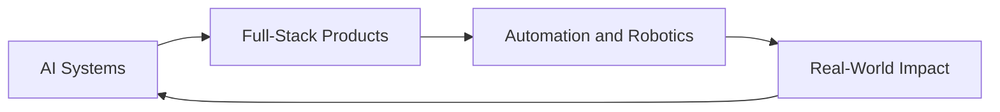

<p align="center">
  
</p>

<p align="center">
  
</p>

<p align="center">
  <a href="https://nine.codes"></a>
  <a href="mailto:natthanarong.tian@gmail.com"></a>
  <a href="https://www.linkedin.com/in/natthanarong-tiangjit"></a>
</p>

<p align="center">
  
  
  
  
</p>

---

> `MISSION CONTROL ONLINE`  
> I build useful things where **AI**, **software**, and **physical systems** meet — and ship them.

## `TEL://CONTRIBUTIONS`

Live telemetry from the build floor.

<p align="center">
  
  
</p>

<p align="center">
  
</p>

<p align="center">
  <picture>
    <source media="(prefers-color-scheme: dark)" srcset="https://raw.githubusercontent.com/NineNatthanarong/NineNatthanarong/output/github-contribution-grid-snake-dark.svg" />
    <source media="(prefers-color-scheme: light)" srcset="https://raw.githubusercontent.com/NineNatthanarong/NineNatthanarong/output/github-contribution-grid-snake.svg" />
    
  </picture>
</p>

<p align="center">
  <em>642+ contributions this year · shipping across AI, product, and automation.</em>
</p>

## `BAY://WORK_STREAMS`

Three bays. One builder.

<table>
  <tr>
    <td width="33%" valign="top">
      <strong>◈ AI SYSTEMS</strong><br/><br/>
      RAG pipelines, LLM apps, NLP, computer vision, and model deployment — from notebook to something people can actually use.<br/><br/>
      <code>Super AI SS5</code> · <a href="https://github.com/NineNatthanarong/NRAG">NRAG</a>
    </td>
    <td width="33%" valign="top">
      <strong>◈ FULL-STACK PRODUCTS</strong><br/><br/>
      Interfaces, APIs, and tools with product thinking — clean UX, solid backends, shipped end-to-end.<br/><br/>
      <a href="https://nine.codes">nine.codes</a> · <a href="https://github.com/NineNatthanarong/functions-codes">functions.codes</a> · 10+ sites
    </td>
    <td width="33%" valign="top">
      <strong>◈ AUTOMATION & ROBOTICS</strong><br/><br/>
      PLC, ABB robotics, and CV-in-the-loop systems that connect code to machines on the floor.<br/><br/>
      <code>BU ROBOTSTUDIO</code> · Smart Parking · 7 robots built
    </td>
  </tr>
</table>



## `BUILD://FEATURED`

| Build | What shipped |
| --- | --- |
| **[Super AI Engineer SS5](https://github.com/NineNatthanarong/NRAG)** | Award-winning **RAG chatbot** — Outstanding Innovation Award; later **CAIO** for business chatbot solutions |
| **AI Smart Parking** | **PLC Competition Thailand** finalist — PLC programming + AI computer vision for parking ops |
| **HyperGas AI** | AI safety-training system for gas stations — fewer human errors, sharper operational readiness |
| **[functions.codes](https://github.com/NineNatthanarong/functions-codes)** | Ad-free utility platform (incl. PDF tools) — Next.js, clean UI, zero noise |

<p align="center">
  <a href="https://github.com/NineNatthanarong/NRAG"></a>
  <a href="https://github.com/NineNatthanarong/functions-codes"></a>
  <a href="https://github.com/NineNatthanarong/exama"></a>
</p>

## `PROOF://MISSION_LOG`

<p align="center">
  
  
  
  
</p>

| Signal | Proof |
| --- | --- |
| **Award** | **Outstanding Innovation Award** — Super AI Engineer Season 5 (AiAT) |
| **Leadership** | **Head of Operations @ BU ROBOTSTUDIO** — 50+ members; Staff → Ops Lead → Head |
| **Range** | AI · full-stack software · robotics / industrial automation |
| **Track record** | Finalist / selected: PLC Competition Thailand · LearnLab Innovation · PTT Gaskathon · Mitsubishi PLC 2026 · ABB Automation Top 8 |

```text
2026  → Mitsubishi PLC Competition 2026 · Trainee Internship
2025  → Head of Operations @ BU ROBOTSTUDIO
2025  → Outstanding Innovation Award @ Super AI Engineer SS5
2024  → Finalist: PLC Thailand · LearnLab · PTT Gaskathon
2024  → Learning Express × Singapore Polytechnic
NOW   → Building AI, software, and automation with real utility
```

## `STACK://ARSENAL`

**AI / DATA**  
`Python` `LLM Apps` `RAG` `NLP` `Computer Vision` `Object Detection` `Model Deployment` `Data Science`

**SOFTWARE**  
`TypeScript` `JavaScript` `React` `Next.js` `Node.js` `Express` `Django` `Tailwind` `Docker` `CI/CD`

**ROBOTICS / AUTOMATION**  
`PLC` `Ladder Logic` `ABB Robotics` `Point Cloud` `Embedded Workflows` `Serial Comms`

## `LINK://CONTACT`

- Portfolio → **[nine.codes](https://nine.codes)**
- LinkedIn → **[natthanarong-tiangjit](https://www.linkedin.com/in/natthanarong-tiangjit)**
- Email → **[natthanarong.tian@gmail.com](mailto:natthanarong.tian@gmail.com)**

---

<p align="center">
  
</p>

<p align="center">
  <em>Mission Control · build useful tech with depth, speed, and creative engineering.</em>
</p>
