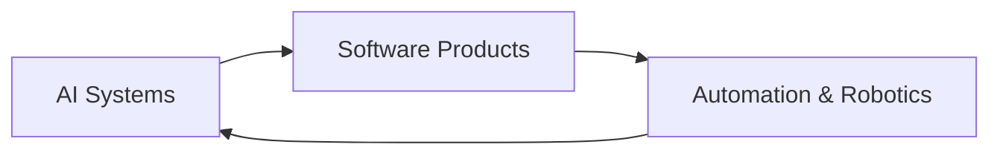

<h1 align="center">Natthanarong Tiangjit</h1>

<p align="center">
  <strong>AI Software Developer · Full-Stack Builder · Robotics Engineer</strong>
</p>

<p align="center">
  Building useful systems across AI, software, and automation.
</p>

<p align="center">
  <a href="https://nine.codes">Portfolio</a>
  ·
  <a href="mailto:natthanarong.tian@gmail.com">Email</a>
  ·
  <a href="https://www.linkedin.com/in/natthanarong-tiangjit">LinkedIn</a>
</p>

---

> **Signal over noise.**  
> I’d rather show work, range, and impact than depend on fragile dashboard images.

## 01 — Profile

```yaml
name: Natthanarong Tiangjit
nickname: Nine
location: Bangkok, Thailand
education: AI Engineering & Data Science @ Bangkok University
scholarship: Tech Talent Scholarship (100%)
current_role: Head of Operations @ BU ROBOTSTUDIO
focus:
  - Applied AI
  - Full-stack product development
  - Robotics and industrial automation
availability:
  - Full-time
  - Internship
  - Freelance
  - Remote collaboration
```

I build practical products at the intersection of **AI**, **software engineering**, and **real-world systems**.

My work ranges from **RAG chatbots** and **web applications** to **PLC-based automation**, **computer vision**, and **robotics projects** designed for actual use, not just prototypes.

## 02 — Build Space



<table>
  <tr>
    <td width="33%">
      <strong>AI</strong><br/>
      LLM apps, RAG systems, NLP, computer vision, object detection, and model deployment.
    </td>
    <td width="33%">
      <strong>Software</strong><br/>
      Full-stack applications built with clean UX, solid backend logic, and production-minded execution.
    </td>
    <td width="33%">
      <strong>Automation</strong><br/>
      Robotics, PLC workflows, and engineering projects that connect software to the physical world.
    </td>
  </tr>
</table>

## 03 — Selected Impact

| Area | Highlight |
| --- | --- |
| **Award** | **Outstanding Innovation Award** — **Super AI Engineer Season 5** |
| **Leadership** | **Head of Operations @ BU ROBOTSTUDIO**, helping lead **50+ members** |
| **Build Volume** | Built **15+ projects** across AI, web, and automation |
| **Engineering** | Designed and built **7 robots** |
| **International Program** | Joined the **Learning Express Program with Singapore Polytechnic** for **3 consecutive years** |
| **Competitions** | Finalist / selected participant in **PLC Competition Thailand**, **LearnLab Innovation**, **PTT Gaskathon**, and **Mitsubishi PLC Competition 2026** |

## 04 — Featured Work

<table>
  <tr>
    <td width="50%">
      <strong>Super AI Engineer SS5</strong><br/>
      Built an award-winning <strong>RAG chatbot</strong>, received the <strong>Outstanding Innovation Award</strong>, and later contributed in a <strong>CAIO</strong> role for business chatbot solutions.
    </td>
    <td width="50%">
      <strong>AI Smart Parking System</strong><br/>
      Finalist project for <strong>PLC Competition Thailand 2024</strong>, combining <strong>PLC programming</strong> with <strong>AI-powered computer vision</strong>.
    </td>
  </tr>
  <tr>
    <td width="50%">
      <strong>HyperGas AI</strong><br/>
      Built an <strong>AI safety training system</strong> for gas station workflows, aimed at reducing human error and improving operational readiness.
    </td>
    <td width="50%">
      <strong>Indie & Creative Builds</strong><br/>
      Created useful tools and experimental products including <strong>functions.codes</strong>, AI/AR concept projects, and self-driven end-to-end AI builds.
    </td>
  </tr>
</table>

## 05 — Experience Snapshot

### BU ROBOTSTUDIO — Head of Operations
- Help lead operations, activities, workshops, and technical community initiatives
- Worked across roles from **Staff → Operation Lead → Head of Operations**
- Support a growing robotics-focused community with execution and coordination

### AI / Product Builder
- Build systems that combine **AI capability**, **usable interfaces**, and **real deployment value**
- Comfortable moving from idea to product architecture to implementation

### Robotics / Automation Projects
- Work on practical engineering projects involving **PLC**, **ABB robotics**, and software-hardware integration

## 06 — Tech Footprint

**AI / Data**  
`Python` `LLM Applications` `RAG` `NLP` `Computer Vision` `Object Detection` `Model Deployment`

**Software Engineering**  
`TypeScript` `JavaScript` `React` `Next.js` `Node.js` `Django` `Tailwind CSS`

**Automation / Robotics**  
`PLC Programming` `ABB Robotics` `Embedded Workflows` `Applied Engineering`

## 07 — What I’m Looking For

I’m especially interested in opportunities involving:

- **Applied AI**
- **Software engineering for intelligent products**
- **Automation, robotics, or industrial technology**
- **Teams that value ownership, speed, clarity, and execution**

## 08 — Contact

- Portfolio: **[nine.codes](https://nine.codes)**
- LinkedIn: **[natthanarong-tiangjit](https://www.linkedin.com/in/natthanarong-tiangjit)**
- Email: **[natthanarong.tian@gmail.com](mailto:natthanarong.tian@gmail.com)**

---

<p align="center">
  <em>Building useful technology with depth, clarity, and execution.</em>
</p>
